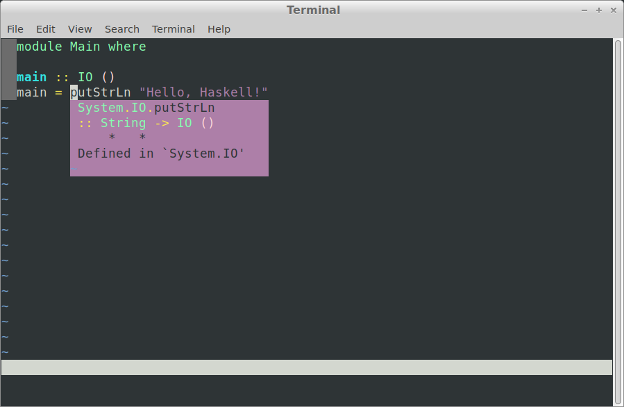

# docker-ghcide-neovim

Install [ghcide](https://github.com/digital-asset/ghcide), [Neovim](https://neovim.io/),
and [CoC](https://github.com/neoclide/coc.nvim) in a minimal Debian 10 Docker container as of May 2020.

The [Dockerfile](Dockerfile) is based on [Marco Lopes' instructions](http://marco-lopes.com/articles/Vim-and-Haskell-in-2019/)
with some tweaks to get things to work with the latest versions of each component.

The purpose is to pin down all the dependencies and configurations; I don't use this container to do actual development work.

The Dockerfile will install and configure:

1. Debian build requirements, GHC, cabal-install;
1. ghcide;
1. neovim;
1. plugged, coc.vim, haskell-vim; and
1. a skeleton hello-world project.

To build the container:

    git clone https://github.com/carlohamalainen/docker-ghcide-neovim.git
    cd docker-ghcide-neovim
    ./build.sh

This takes about 30 minutes on a 4th gen Lenovo X1 Carbon laptop.

Full output: [build.txt](build.txt)

In particular, note the output of ``ghcide`` in the sample project directory. This shows you
what ghcide can work with, and is worth checking before messing around with Vim/Neovim settings.

To run the container:

    ./run.sh

In the container, launch Neovim:

    ../nvim Main.hs

Check that ghcide is working by moving the cursor over ``putStrLn`` and show its type using ``K``:

